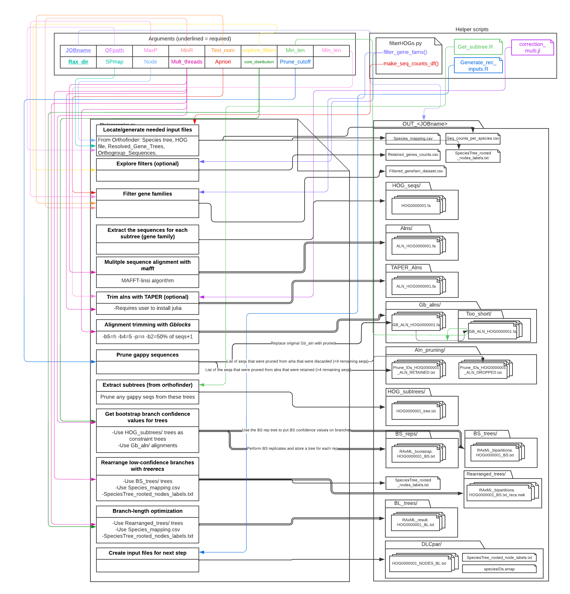

<a name="top"></a>


# ERCnet documentation:
1. [Overview](#overview)
2. [Preparing input data](#input)
3. [Running ERCnet](#run)
4. [Output files](#output)
5. [Supplementary scripts](#supp)
    

## <ins>**Overview**</ins> <a name="overview"></a>

# ERCnet: a program for running genome-wide ERC analyses in the presence of gene duplication and performing ERC-based network analyses.

The full ERCnet workflow consistst of the following steps:
1. *Phylogenomic analyses*
1. *Gene-tree/Species-tree reconciliation*
1. *ERC analyses (including branch-length reconciliation)*
1. *Network analyses (including community classification)*

## Citation
Please cite [this paper](https://www.biorxiv.org/content/10.1101/2024.08.06.606904v1.abstract) if you use ERCnet.

## <ins>**Preparing input data**</ins> <a name="input"></a>

ERCnet directly uses the output from [Orthofinder gene family clustering](https://github.com/davidemms/OrthoFinder)

Orthofinder provides [guidelines](https://davidemms.github.io/orthofinder_tutorials/orthofinder-best-practices.html) to selecting taxa and obtaining and preparing proteome files. In addition, please adhere to the following ERCnet-specific guidelines/recommendations to running Orthofinder upstream of ERCnet:

## Best practices for preparing data for Orthofinder/ERCnet:
*Note that not all of these guidelines are required, but following them minimized the probablity of errors/issues/annoying-quirks when running ERCnet.*
* Taxon sampling considerations:
    * Number of species to include:
        * We recommend between 6-20 ingroup taxa, although this range is somewhat arbitrary. 
        * Stay tuned for our upcoming paper (currently in prep) that weighs the tradeoffs in adding more species to an analysis. This paper will provide a more empirical basis for choosing the nubmer of taxa to include. 
    * Which species to include:
        * There isn't a lot of empirical data on how ERCnet works at different levels of divergence, so the choice of which species to include is driven by trying to accomplish the following:
            * Include an outgroup
            * Include a ‘model organism’ in the ingroup if possible, so that ERCnet can use this model as a reference for functionally annotating gene families.
            * Sample multiple independent evolutionary transition events across the tree.
                * This is only relevant if you're using ERCnet in a targetted way to study a specific biological process involving a priori known evoluionary transitions (see the independent 'plastid proteostasis perturbation events' described in [Forsythe et al., 2021](https://academic.oup.com/plcell/article/33/4/980/6122720) as an example).
          
* For each species, you'll need:
    * A proteome fasta file:
        * Protein sequences for all genes in the genome
        * These should not include multiple alternative splice isoforms per locus because Orthofinder will confuse these for paralogs
          
* Formatting considerations:
    * It can be helpful to adopt consistent naming conventions early on:
        * E.g. for Arabidopsis thaliana:
            * File name: Atha.fa
            * Sequence IDs: >Atha__AT1G035221
            * *Note that orthofinder uses the 'Atha' from the file name as a text string to search for 'Atha' in the sequence IDs. It really does help to make sure your file names include a unique text string (e.g. 'Atha') that is present in the sequence IDs for that species.*
            * *Also, note that the double-underscore in the seq ID is not required, but it can be helpful as a unique search pattern later on.*
    * We suggest removing 'weird' characters (e.g. spaces, commas, quotes, |, etc...) from your sequence IDs if possible.
    * IMPORTANT: We discovered that the Gblocks step of ERCnet is not able to handle sequence IDs that are >74 characters long. We are working to find a solution for this requirement, but in the meantime, it's best to keep sequence ID's <75 characters in length.
    
## Running Orthofinder (specific instructions for ERCnet analyses):

* For easy installation  of Orthofinder, we recommend creating an [anaconda environment](https://www.anaconda.com/) and then using conda to install orthofinder within that environment with the following command `conda install -c bioconda orthofinder=2.5.4`(here we specify the version we used for testing ERCnet data)
    * Even if you haven't used anaconda before, it's worth becoming familiar with anaconda environments because ERCnet relies of conda installations for several dependencies.
    * See below for detailed instructions on setting up conda environments to run ERCnet.

* Include a well-defined outgroup in taxon-sampling.
    * ERCnet uses the outgroup to define and seperate taxon-complete subtrees within larger gene families
    * After running Orthofinder, be sure to inspect the inferred rooted species tree (output by Orthofinder
) to ensure that the expected root was used. 
    * If not, reroot the tree manually and input as a user-defined rooted species tree for another run of Orthofinder. Only proceed to ERCnet with Orthofinder results generated under a believable species tree.

* Run Orthofinder with the -y argument to indicate that subtrees be split into seperate subfamilies (Orthofinder HOGs)

* We would recommend running Orthofinder on a super computer if possible. During testing of moderate-sized datasets (~20 proteomes), Orthofinder finished in <24 hours distributed across 48 cores.

Example Orthofinder run:
```
orthofinder -f <path/to/dir/containing/proteomes/> -y -X -M msa -t <number of threads available on computing system>
```


## <ins>**Running ERCnet**</ins> <a name="run"></a>

Different ERCnet steps require different dependencies. Most notably, the *Gene-tree/Species-tree reconciliation* step requires python2 (because DLCpar only supports python2) while the other steps require python3. The need to switch between python 2 and 3 environments is a big part of our recommendation to use anaconda environments.

| ERCnet step  | Python version | Dependencies|
| ------------- |:-------------:|:-------------:|
| *Phylogenomic analyses* | 3 | pandas, biopython, mafft, gblocks, raxml, stringr, ape, phytools, joblib, scipy, treerecs |
| *Gene-tree/Species-tree reconciliation* | 2 | dlcpar |
| *ERC analyses* | 3 | ape, stringr, phytools |
| *Network analyses* | 3 | igraph |

Below we provide detailed instructions for configuring environments for each step of ERCnet.

We have provided sample input data for a very small ERCnet run in to test whether ERCnet and dependencies are configured properly. These data are located in the SampleData directory and are formatted similar to Orthofinder output. Note that you will need to copy Species_mapping.csv into the main ERCnet directory in order to run a test run on the sample data. 


### 1. Phylogenomic analyses
#### Installing dependencies

Before running the *Phylogenomic analyses* of ERCnet, we recommend installing all dependencies in an anaconda environment. Users can set up their environment in two ways.
First, we have provided a preconfigured yml file that can be used to automatically set up a python 3 environment for steps 1, 3 and 4 of ERCnet.
To create your environment using the yml file, use the following command (this can take 10-20 minutes):

```
conda env create -f ERCnet_py3_environment.yml
```
*Note: A PREFIX line can be added to the yml file to specify the location of the conda environment in the file system.*

Alternatively, users can manually create their environment and install dependenices individually using the following commands:
```
#Create a conda environment with python 3
conda create -n test3 python=3.9.7
conda activate test3

#Install python modules
conda install -c conda-forge pandas
conda install -c conda-forge biopython
conda install -c conda-forge joblib
conda install -c conda-forge scipy

#Install phylogenetics-related programs
conda install -c bioconda mafft
conda install -c bioconda gblocks
conda install -c bioconda raxml
conda install -c bioconda treerecs

#Install R package (specific versions included when important)
conda install -c conda-forge r-base=4.1.2
conda install -c conda-forge r-stringr
conda install -c conda-forge r-ape=5.6
conda install -c conda-forge r-phytools
conda install -c conda-forge r-igraph
```

#### Running Phylogenomic analyses
To see a list of arguments for ERCnet use `./Phylogenomics.py --help`

* Input files:
    * Output from Orthofinder found in the folowing folders:
        * Species_Tree/
        * Phylogenetic_Hierarchical_Orthogroups/
        * Resolved_Gene_Trees/
        * Orthogroup_Sequences/
    * An optional species mapping file which will be used to tell ERCnet when tips on the species tree correspond to sequence identifiers in alignments/gene trees.

Create a comma-seperated file that indicates a prefix text string found in the sequence IDs in alignments/gene trees and the corresponding tip on the species tree (found in the Species_Tree/ directory of Orthofinder output). Please be sure the formatting exactly matches the example provided below and text strings you provide exactly match the strings within your alignments/gene trees/species trees. Use the -s flag to ensure ERCnet uses your user-provided species  mapping file. If -s is not provided, ERCnet will attempt to create one based on Orthofinder results.

Name the species mapping file "Species_mapping.csv" and save in the main ERC net directory (where all the scripts live).

Example Species_mapping.csv:

```
Prefix,SpeciesID
A_aulacocarpa,A_aulacocarpa_prot
A_thaliana,A_thaliana_prot
A_trichopoda,A_trichopoda_prot
C_sativus,C_sativus_prot
E_grandis,E_grandis_prot
G_maderense,G_maderense_prot
G_raimondii,G_raimondii_prot
H_annuus,H_annuus_prot
L_chinense,L_chinense_prot
L_siphilitica,L_siphilitica_prot
M_acuminata,M_acuminata_prot
O_biennis,O_biennis_prot
O_sativa,O_sativa_prot
P_maritima,P_maritima_prot
P_persica,P_persica_prot
P_trichocarpa,P_trichocarpa_prot
S_lycopersicum,S_lycopersicum_prot
S_noctiflora,S_noctiflora_prot
S_polyrhiza,S_polyrhiza_prot
V_vinifera,V_vinifera_prot
```

You may also optionally provide a list of genes you'd like to study. To do so, use the `--A_priori/-a` flag (see below). To use this option you must create a file named "A_priori_genes.csv", which should have one column containing text strings unique to the sequence ID of your genes of interest. The first line of the file should be the species idenifier (see SpeciesID in the table above) of the species that contains the a priori genes. 

Name the a priori genes file "A_priori_genes.csv" and save in the main ERC net directory (where all the scripts live).

Example A_priori_genes.csv:
```
A_thaliana_prot
AT1G49970
AT1G12410
AT1G09130
AT4G17040
AT3G17000
AT5G17380
AT5G48020
AT1G06550
```

To run the *Phylogenomic analyses*, you'll need to set parameters that specify level of stringency with which to filter the Orthofinder gene families to be input into the phylogenomic pipeline. To inform this decision, we recommend running Phylogenomics.py with the --explore_filters (-e) flag, which will perform a parameter scan and return a table indicating the number of gene families retained under different filters.

Example:
```
./Phylogenomics.py -j <jobname> -e -s -o <path/to/orthofinder/results/> -x <path/to/raxml/installation/>
```

All options for Phylogenomics.py:

| Short flag  | Long flag | Description| Required? | Default value |
| ------------- |:-------------:|:-------------:|:-------------:|:-------------:|
| -h | --help | Print help menu | no | NA |
| -j | --JOBname | Unique job name for this run of ERCnet. Avoid including spaces or special characters ("_" is ok) | yes | NA |
| -o | --OFPath | Full path to the Orthofinder results dir (should containSpecies_Tree/, Phylogenetic_Hierarchical_Orthogroups/ etc...) Include "/" at the end of the string | yes | NA |
| -p | --MaxP | Integer: maximum number of paralogs per species allowed ineach gene family | yes, unless -e is chosen | 3* |
| -r | --MinR | Integer: minimum number of species represented required ineach gene family | yes, unless -e is chosen | 10* |
| -t  | --Test_num | Integer: number of gene families to analyze. This option is intended to help you test whether ERCnet is working on your system by running a small subset of genes before running the full dataset | no | NA |
| -e | --explore_filters | Add this flag to explore filtering options (-p and -r parameters). If selected, program will output parameter scan table and quit without running downstream steps. If -e is chosen it will negate -p and -r. Note that -s is still required if -e is chosen. | no | NA |
| -l | --Min_len | Integer: minimum length of alignment (after trimming with Gblocks) required to retain gene for downstream analyses | yes | 100 |
| -x | --Rax_dir | Full path to the directory in which your raxml program is installed (use "which raxmlHPC" command to locate). Include "/" at the end of the string. | yes | NA |
| -s | --SPmap | Add this flag to provide a custom species mapping file. Not required if the tip labels on the orthofinder species tree exactly match the species prefix in sequence IDs. Mapping file must be formatted in certian way. See instuctions | no | NA |
| -n | --Node |Interger: indicate the node on the species tree that you would like to use to retrieve orthofinder HOGs (subtrees). Assuming your species tree has a single outgroup, you'll probably want N1 (default). However, if you species tree has multiple outgroups (or if you'd just like to perform an ERC analysis on a subset of the species tree), you can indicate which node to use for subtree extracting. E.g. For N2.tsv, "-n 2" or "--Node 2"  | no | 1* |
| -m | --Mult_threads |Integer: number of threads avilable for parallel computing (default = 1). Performing a full-genome analyses will likely require supercomputing resources| no | 1 |
| -a | --Apriori | Add this flag to provide an *a priori* list of genes to analyze. The list must be in a file named "A_priori_genes.csv" and formatted in a specific way. See instructions above for more information. When you're using the -a option you probably don't want to use the -t option | no | NA |
| -c | --core_distribution | Sets the group (1/2/3) core_distribution strategy for Raxml processing. This determines how many 'front end' parallel cores are running and how many 'back end' cores are given to each multi-threaded Raxml process. See table below for group definitions | no | 1 |
| -P | --Prune_cutoff | Float: prune seqs from alignments if the proportion of gap sites exceeds this number | no | 0.9 |
| -T | --Taper | Run TAPER trimming of alignments? If selected, the user must include full path to installation of julia (should end in "bin/)" | no | "no" |

*Values for these parameters can have a large impact on analyses so make sure the values make biological sense for your analysis before opting for default values.

A note about (optionally) running the TAPER trimming step:
[TAPER](https://github.com/chaoszhang/TAPER) is written in julia. We're including the TAPER script (correction_multi.jl) in ERCnet but you'll need to download the julia program and indicate the full path to the julia executable in order to run TAPER. Follow instructions on the TAPER github page for how to 'install' julia (simply unzip precompiled folder). We have had the best luck with Julia version 1.8.2. Follow these steps to obtain the pre-compiled executable for (for linux):
```
curl https://julialang-s3.julialang.org/bin/linux/x64/1.8/julia-1.8.2-linux-x86_64.tar.gz > julia-1.8.2-linux-x86_64.tar.gz

tar -xvzf julia-1.8.2-linux-x86_64.tar.gz
```
core_distribution groups for Phylogenomics.py. 

| Group | Front End Cores | Back End Cores | 
| ------------- |:-------------:|:-------------:|
| 1 | 2 | num_cores / 2 |
| 2 | num_cores / 4 | 4 |
| 3 | num_cores / 2 | 2 |

*'Front End' parallelization refers to the paralellization support from Joblib, indicating the number of processes inside any given Phylogenetics computational step are being spawned.

*'Back End' parallelization specifically refers to the number of cores that are passed to RAXML's native multi-threading support. 

Use the table output by running the --explore_filters option (above) to choose reasonable values for -p and -r. 

Use the options described above to run the full *Phylogenomic analyses*

Example:
```
./Phylogenomics.py -j test_job -e -s -p 3 -r 10 -l 100 -n 1 -o <path/to/orthofinder/results/> -x <path/to/raxml/installation/>
```

Brief(ish) walkthrough of what Phylogenomics.py does:
* Filters orthofinder gene families (called HOGs) to remove those that underwent too much gene duplication and/or loss (the user defines what 'too much' means by setting the -r and -p parameters)
   * The user can use the -e argument to make an informed decision on the tradeoffs of -r and -p choice
* Mulitple sequence alignment of gene families (sometimes called 'subtrees' because orthofinder extracts them from larger gene families).
* Optionally trim alignments with TAPER to find poorly aligned stretches of individual sequences and mask these stretches with "-"
* Gblocks trimming of alignments to remove poorly-aligned sites
* Check if any individual seq is mostly gap, prune that sequence from the alignment if so.
* Phylogenetic bootstrap analysis to generate bootstrap support scores for the gene trees generated by Orothfinder
* Rearrange/correct poorly-supported (<80% bootstrap support) branches and root the tree
   * Rearrangement and rooting are both accomlished by gene-tree/species-tree reconciliation in Treerecs
* Optimize branch lengths with raxml using the the Gblocks-trimmed alignments and the new rearranged trees as constraint trees.

A VERY busy diagram of what Phylogenomics.py is doing (this is intended for super-users who want all the details). Figure generated with LucidCharts:


## 2. Gene-tree/Species-tree reconciliation
This step uses DLCpar GT/ST reconciliation to 'map' the nodes on the gene trees to appropriate nodes on the species tree. This mapping information is necessary for the subsequence branch-length reconciliation step (which occurs later during the ERC analysis step of ERCnet). Note that GT/ST reconciliation was used in a different context (correcting/rooting trees) in the Phylogenomics step above. 

#### Installing dependencies
This step uses DLCpar, which is written in python2. This means you'll need to setup a python2 environment to run this step of the analysis. Below are instuctions for setting up the environment and installing DLCpar with anaconda
```
#Create python2 env
conda create --name dlcpar_py27 python=2.7
#Activate it
conda activate dlcpar_py27
#Install dlcpar
conda install -c bioconda dlcpar
```
#### Running Gene-tree/Species-tree reconciliation analyses
All options for GTST_reconciliation.py:

| Short flag  | Long flag | Description| Required? | Default value |
| ------------- |:-------------:|:-------------:|:-------------:|:-------------:|
| -h | --help | Print help menu | no | NA |
| -j | --JOBname | Unique job name for this run of ERCnet. This should be the exact same as the jobname used for the Phylogenomics step | yes | NA |

Example command:
```
./GTST_reconciliation.py -j test_job
```

## 3. ERC analyses
Here we extract branch lengths from the gene trees generated above and compare those branch lengths across each pair of genes to ask if those genes show signs of coevolving. Extracting the branch lengths is not trivial, requiring the development of a new approach (described below).

#### Installing dependencies
The rest of ERCnet using python3 so you'll need to switch back to the original anacona env you setup above
```
#List available envs as a reminder
conda info --envs
#Activate the previously setup env (named test3 if you followed along above)
conda activate test3
```
#### Running ERC analyses
All options for ERC_analyses.py:

| Short flag  | Long flag | Description| Required? | Default value |
| ------------- |:-------------:|:-------------:|:-------------:|:-------------:|
| -h | --help | Print help menu | no | NA |
| -j | --JOBname | Unique job name for this run of ERCnet. This should be the exact same as the jobname used in the previous steps | yes | NA |
| -m | --Mult_threads |Integer: number of threads avilable for parallel computing (default = 1). Performing all-by-all analyses means the number of correlations calculated increases exponentially so this step is rate-limiting | no | 1 |
| -b | --branchMethod | This determins which branch reconcilliation method to use. Enter either "BXB" for branch by branch or "R2T" root to tip. | yes | NA |
| -s | --FocalSP | The name of the focal species to represent each gene family (should exactly match the tip label of the species tree). See further description below | yes | NA |
| -M | --Meta_stats | The type of report of metadata from ERC correlations you want. "none" for no reports, "full" for report including all pairwise-stats (very slow/memory-intensive for large dataset), "hits" for trimmed down report of potential hits | no | none |

Example command:
```
./ERC_analyses.py -j test_job -m 1 -s A_thaliana_prot -M hits
```

What ERC_analyses.py does:
* Branch-length reconciliation
The overall goal of ERCnet is to compare branch lengths (i.e. rates of evolution) between different gene trees. However, when two gene trees have been subject to different histories of duplication/loss (even low levels), they do not have the same branches, so there is not a clear 'apples-to-apples' comparison. In the past, this challenge has been side-stepped by using the length of paths of several branches leading from the root of the tree to a given tip (i.e. root-to-tip approach). This approach is not ideal and can introduce error (both type I and type II). Therefore, we developed a strategy for measuring the rate of evolution along individual branches of the tree (i.e. branch-by-branch). The method is build on similar logic to GT/ST reconciliation, which recognizes that all gene trees have evolved within an over-arching species tree. Therefore, the species tree can be used as a common denominator for making 'apples-to-apples' comparisons between gene trees with vastily different duplication/loss histories. To accomplish this, we use the branches on each gene tree to measure the amount of evolution that occured along branches of the species tree. Sometimes multiple gene tree branches existed within in single species tree branch (e.g. two paralogs both evolving in the same species), meaning we average the branch-lengths. Sometimes a gene tree does not have branches that speak to the evolution in a species tree branch (e.g. the gene was lost in a particular species), meaning the branch legnth is NA for that particular gene. As long and we can successfully map the gene tree branches to the species tree branch, we can extract all available branch length information for use in ERC analyses.
* Root-to-tip branch length extraction
   * Because it's relatively simple, we extract root-to-tip branch lengths in addition to the branch-by-branch approach described above. The user can decide which to use in downstream analyses.
* Normalization of branch lengths
   * branch lengths in each gene are normalized by the genome-wide
* Pair-wise all-by-all ERC analyses
   * Branch length correlation analyses are performed between all combinations of genes

## 4. Network analyses
The all-by-all nature of the ERC results mean that graph theory is a useful framework to explore interactions. Here, we generate networks representing significant 'ERC hits'. The user difines the type of correlation statistic and the cutoff values for what to consider 'significant'.

#### Installing dependencies
This step makes use of the R package igraph. If you followed the instructions above, igraph should already be installed on your python3 environment. 

#### Running Network analyses
All options for Network_analyses.py:

| Short flag  | Long flag | Description| Required? | Default value |
| ------------- |:-------------:|:-------------:|:-------------:|:-------------:|
| -h | --help | Print help menu | no | NA |
| -j | --JOBname | Unique job name for this run of ERCnet. This should be the exact same as the jobname used in the previous steps | yes | NA |
| -m | --BLmethod | Branch length method ERC results to be used in the network. "bxb" for Branch-by-branch. "r2t" for root-to-tip. | yes | NA |
| -p | --PValue | Cuttoff for P value by which to filter ERC hits in network. Float between 0 and 1. | no | 0.05 |
| -r | --RSquared | Cuttoff R-squared value by which to filter ERC hits in network. Float between 0 and 1. | no | 0.50 |
| -c | --CorrMethod | The type of correlation method by which you would like to filter P Value and R value. Should be 'pearson', 'spearman', or 'both'. | no | "both" |
| -S | --Strict | Filters ERC results p-values corrected with Benjamini-Hochberg False Discovery Rate | no | not used be default |
| -y | --Clustmeth | Clustering method to be used to identify communities in network. "fg" for fast-and-greedy (fastest), "eb" for edge-betweenness, "op" for optimal, and "wt" for walktrap. | yes | NA |
| -t | --Trim_Cutoff | Must be an integer. Indicates the minimum number of nodes necessary for a community to be displayed on the network plot. Communitiies smaller than this number will be trimmed from the graph (and associated output tables). This option is mainly for network aesthetics. | no | 0 |
| -s | --FocalSP | The name of the focal species to represent each gene family (should exactly match the tip label of the species tree). See further description below |
| -f | --FileName | The filename of ERC_results file you would like to analyze. Should be .tsv file | yes | NA |
| -F | --Func_cat | Run a functional clustering analysis with user-provided functional information about genes in the focal species? If selected, provide the name of the tsv file. See documentation for formatting. | no | False |
| -L | --Lab_nodes | Add node labels to the network? If selected, youll need to provide a tsv files of node labels. See documentation for formatting | no | False |

Example command:
```
./Network_analyses.py -j test_job -m r2t -y fg -s A_thaliana_prot -F Functional_categories.tsv
```

What Network_analyses.py does:
* Filter the ERC results to retain only the 'significant' correlations. 
   * The user uses the -m argument to choose which branch lengths should be used for correlation analyses 
   * The user uses the -f argument to choose whether to use the p-value or R-squared value
   * The user uses the -c argument to choose what cutoff value to use. Note that -f=pval means lower values are more stringent whereas -f=R2 means higher values are more stringent. 
* Generate a network diagram from ERC results
   * Nodes represent genes 
   * edges represent significant ERC correlation between genes
* Cluster communities of connected genes
   * Clustering is a complicated task in graph theory. Currently we provide four different algorithms, which the user selects with the -y argument.
* Extract gene names associated with communities
   * A common downstream analysis would be to ask if the genes within a community are enriched for a particular function. To do this, you'll need a gene ID to represnt each gene in the network (technically the nodes represnt gene families/trees). The user can set which species is the best model organism to represent the gene family using the -s argument. We recommend using the species that has the best functional annotations. 
* Extract other global network statistics (TBD) 

#### Running the optional functional categories analysis
If you select the -F option, you'll need to provide two files named Functional_categories.tsv and Functional_categories_col_assign.tsv. Be sure that the file names and formatting are identical to the examples provided.

Functional_categories.tsv provides a priori functional information (e.g. subcellular localization) about the genes in the network. The ID's should exactly match the sequence IDs from your focal species (see above). Functional_category can be anything you want. 

Example Functional_categories.tsv

```
ID	Functional_category
A_thaliana__AT1G01070.1	Unknown
A_thaliana__AT1G01080.1	Plastid
A_thaliana__AT1G01090.1	Plastid
A_thaliana__AT1G01100.1	Other
A_thaliana__AT1G01170.1	Mitochondria
A_thaliana__AT1G01180.1	Unknown
A_thaliana__AT1G01190.1	Unknown
A_thaliana__AT1G01200.1	Other
A_thaliana__AT1G01225.1	Unknown
A_thaliana__AT1G01230.1	Other
A_thaliana__AT1G01240.1	Unknown
A_thaliana__AT1G01250.1	Other
A_thaliana__AT1G01290.1	Mitochondria
A_thaliana__AT1G01335.1	Unknown
A_thaliana__AT1G01340.1	Other
A_thaliana__AT1G01355.1	Unknown
A_thaliana__AT1G01360.1	Other
```

Functional_categories_col_assign.tsv tells igraph the color assignments for the different categories when plotting the functional categories network.

Example Functional_categories_col_assign.tsv

```
Category	Color
Plastid	Green
Mitochondria	red
Unknown	gray
Other	gray
Dual	tan
NA	gray
```

Selecting the -F flag will automatically create a figure that calculates the [Nominal Assortativity](https://igraph.org/r/doc/assortativity.html) and compares the observed value against a randomized null distribution.

#### Adding optional node labels to the network figures
If the -L flag is selected the user must provide a Node_labels.tsv file (see example below). Be sure to use the exact filename and formatting as the example.

Example Node_labels.tsv:

```
ID	Label
A_thaliana__AT1G49970.1	CLPR1
A_thaliana__AT1G12410.1	CLPR2
A_thaliana__AT1G09130.1	CLPR3
A_thaliana__AT4G17040.1	CLPR4
A_thaliana__AT1G66670.1	CLPP3
A_thaliana__AT5G45390.1	CLPP4
A_thaliana__AT1G02560.1	CLPP5
A_thaliana__AT1G11750.1	CLPP6
A_thaliana__AT5G51070.1	CLPD
A_thaliana__AT1G68660.1	CLPS
A_thaliana__AT5G50920.1	CLPC1
A_thaliana__AT3G48870.1	CLPC2
A_thaliana__AT4G25370.1	CLPT1
A_thaliana__AT4G12060.1	CLPT2
A_thaliana__AT2G03390.1	CLPF
```
## Benchmarking
ERCnet automatically creates a folder called 'Benchmarking' in the OUT directory of each job. This folder houses information regarding how fast ERCnet is accomplishing tasks given the resources it has. Every major computational step in the ERCnet pipeline has a benchmarking call to it, cataloguing the time the process began and the time it ended as well as a log of the resources allocated for that script. The benchmark then also calculates the total time it took to complete any given step and the number of 'items' (lines written/files processed/etc) completed per minute of run time. These files can be used to gauge general performance of ERCnet and monitor how resource allocation impacts performance. 

**Note:** The benchmarking file is designed for long running analysis' and therefore does not correctly calculate processes which take less than a minute of runtime to complete. 


## <ins>**Output files**</ins> <a name="output"></a>

Below is a brief description of each of the files and subdirectories that are output during a run of ERCnet. Many of the files created are intermediate files, which you likely will not need to inspect. Directories are shown in the order in which they're created during the ERCnet workflow.

- `Species_mapping.csv`: shows how ERCnet recognizes species IDs
- `Seq_counts_per_species.csv`: shows how many homologs from each species were found in each gene family
- `SpeciesTree_rooted_node_labels.txt`: a copy of the species tree from Orthofinder
- `Filtered_genefam_dataset.csv`: each row represents a gene family (hierarchical orthogroup [HOG] from orthofinder) and the seq IDs of all the sequences in the gene family
- `HOG_seqs/`: contains a seperate file for each gene family (hierarchical orthogroup [HOG] from orthofinder).
- `Alns/`: contains a seperate file with a multiple sequences alignment for each HOG
- `TAPER_Alns/`: an (optional) version of the alignments that have been cleaned using TAPER
- `Gb_alns`: a version of the alignments that have been cleaned using GBLOCKS
- `Aln_pruning/`: stores information about sequences that were pruned from alignments because GBLOCKS yielded only gaps
- `HOG_subtrees`: orthfinder produces gene trees for each orthogroup (OG); however, ERCnet works with HOGs (which are subtrees of the larger OG tree). This folder contains the subtrees that are extracted from the larger OG tree.
- `Non-binary_subtrees.txt`: documents any gene families that were dropped from analysis because gene trees (from orthofinder) were non-bifurcating, which causes errors in R.
- `BS_reps/`: subtrees (see HOG_subtrees) are used as a constraint tree and raxml bootstrapping is performed to get confidence values for each branch on the constraint tree. This directory stores the replicate files.
- `BS_trees/`: subtrees with BS confidence scores (from BS_reps)
- `SpeciesTree_mapped_names.txt`: Version of the species tree with the mapped species IDs from Species_mapping.csv.
- `Rearranged_trees`: the treerecs prpgram is used to rearrange any poorly supported branches (<80% bootstrap support) so that the branches best match the species tree.
- `BL_trees/`: branch length optimization is performed on the rearranged version of the tree. **These trees are the final gene trees used to perform ERC**.
- `DLC_par/`: The last step in Phylogenomics.py creates the inputs needed to run DLCpar, which helps map gene trees to the species tree. GTST_reconciliation.py writes additional files to this directory. 
- `BL_results/`: contains the branch lengths that were measured from the BL_trees/ trees. ERCnet measures branches by both branch-by-branch (BXB) and root-to-tip (R2T) methods. This directory also contains the normalized branch lengths, in which each branch length is normalized by the genome-wide average branch legth for that particular branch. 
- `ERC_results/`: This directory contains the results of the all-by-all ERC analysis. This folder will contain seperate ERC results for BXB vs R2T (depending on user selection). See below for the description of the column headers in the ERC_results tsv file. This directory will also contain a subdirectory, `Filtered_results/`, with a tsv file of 'ERC hits' (generated during Network_analyses.py).
   - Column headers in the ERC_results tsv file
      - **GeneA_HOG**: HOG id for 'gene A' (note gene A vs B are abirary terms to denote the two genes being compared in the pairwise ERC comparison)
      - **GeneA_ID**: the seqID for gene A from the 'focal species' (defined be the user)
      - **GeneB_HOG**: HOG id for 'gene B' 
      - **GeneB_ID**: the seqID for gene B from the 'focal species' (defined be the user)
      - **Overlapping_branches**: number of branches shared between gene tree A and B. This is the number of points of the linear correlation plot for a give ERC comparison
      - **Slope**: Slope of the best fit line
      - **P_R2**: Pearson correlation R-squared
      - **P_Pval**: Pearson correlation P-value
      - **S_R2**: Spearman correlation R-squared
      - **S_Pval**: Spearman correlation P-value
      - **P_FDR_Corrected_Pval**: FDR corrected version of the Pearson p-value
      - **S_FDR_Corrected_Pval**: FDR corrected version of the Spearman p-value
- `Network_analyses/`: This directory contains networks displaying the 'ERC hits'. ERC hits are defined by the user according the p-value and r-squared cutoffs during Network_analyses.py. If the user tries several different filtering cutoffs, seperate versions of the network files will be stored here (the file names indicate the cutoffs chosen). To begin inspecting these results, we recommend first looking at the ERC_network*.pdf file. This will give a quick (and sometimes ugly) view of the network. For more detailed inspection, we recommend using the cytoscape GUI program and importing the Cytoscape_network*.graphml file. This creates a much more human-readable and interactive version or the network.


## <ins>**Supplementary scripts**</ins> <a name="supp"></a>
Simulations.py is used to simulate proteomes with subsets of genes that exhibit correlated evolution. A conda environment with pyevolve is needed to run this script. Note that we needed to manually edit the evolver.py file that comes packaged with pyevolve to remove reference to an outdate "Alphabet" data type in biopython.


[Back to Top](#top)


